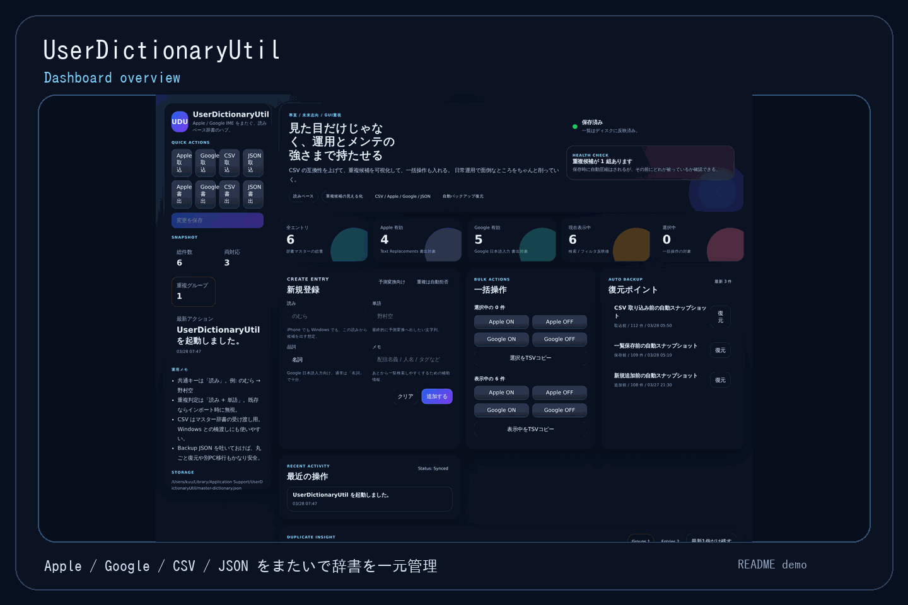
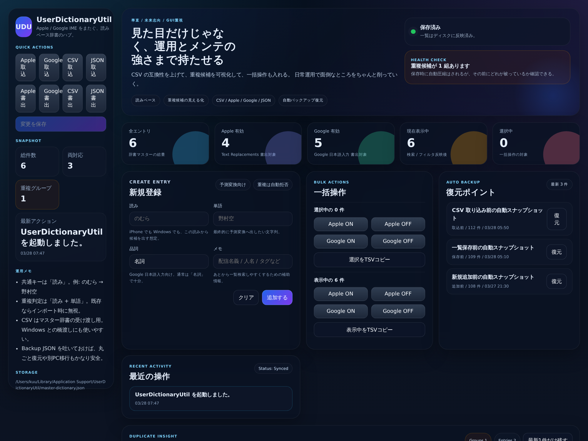
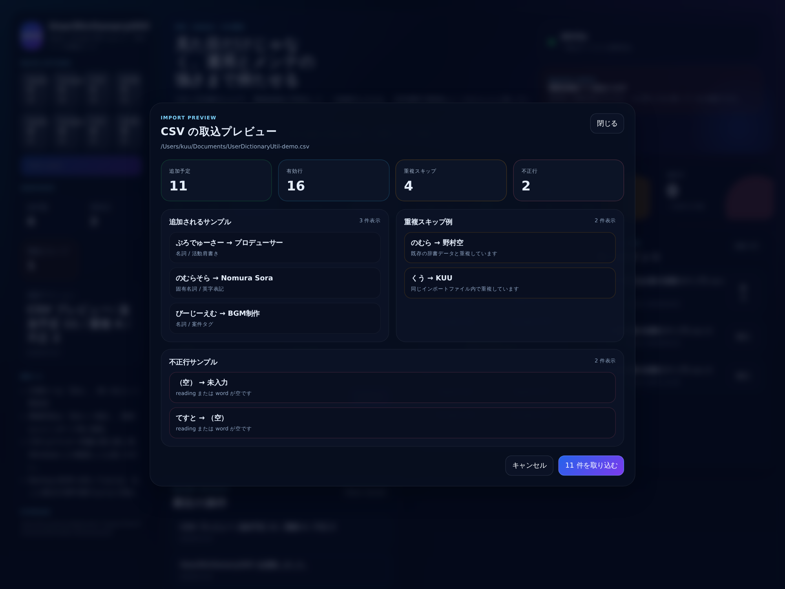
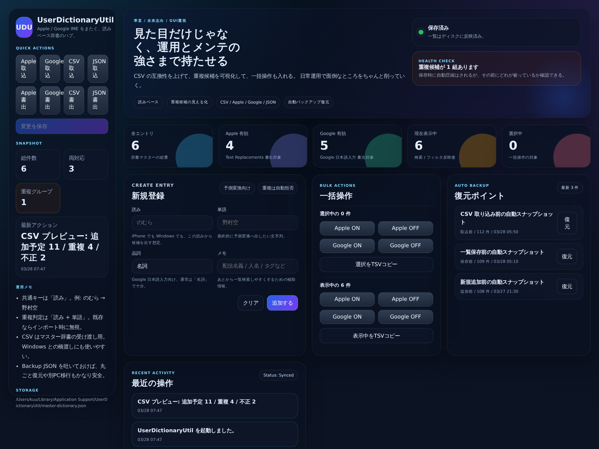

# UserDictionaryUtil

Apple Text Replacements と Google 日本語入力のあいだで、**「読み → 単語」ベースの共通辞書**をまとめて管理する Electron アプリです。

個別の IME ごとに辞書を触るのではなく、**1つのマスター辞書**を持って、Apple / Google / CSV / Backup JSON へ安全に出し入れすることを目的にしています。

---

A desktop app to manage a **single master dictionary** bridging Apple Text Replacements and Google Japanese IME — built with Electron + React + TypeScript.

Instead of editing each IME's dictionary separately, you maintain one source of truth and safely export to Apple plist, Google txt, CSV, or Backup JSON.

---

## デモ / Demo

README 用のサンプルデータで作成したデモ GIF です。実データは使っていません。

*Demo GIF uses sample data only — no real personal data included.*



## スクリーンショット / Screenshots

### ダッシュボード全体 / Dashboard Overview



### インポートプレビュー / Import Preview



### 重複候補の可視化 / Duplicate Insight



---

## 何ができるか / Features

| 機能 | Feature |
|------|---------|
| 読み + 単語のペアで辞書エントリを一元管理 | Centralized dictionary management by reading + word pairs |
| 重複判定キーは `読み + 単語` | Duplicate detection key: `reading + word` |
| Apple Text Replacements (`plist`) の取込 / 書出 | Import / Export Apple plist |
| Google 日本語入力 (`txt`) の取込 / 書出 | Import / Export Google IME txt |
| CSV / TSV の取込 / 書出 | Import / Export CSV / TSV |
| Backup JSON の取込 / 書出 | Import / Export Backup JSON |
| インポート前プレビュー（追加予定 / 重複 / 不正行） | Import preview with counts: to-add / duplicate / invalid |
| 重複候補の可視化・グループ単位の解決 UI | Duplicate Insight with per-group resolution modal |
| 一括編集（品詞・メモ前後付け・Apple/Google ON/OFF） | Bulk edit: POS, note prefix/suffix, Apple/Google flags |
| 削除・一括整理の確認ダイアログ | Confirmation dialog for destructive bulk actions |
| 一括 Apple / Google ON/OFF（選択中 / 表示中） | Bulk Apple / Google toggle (selected or visible rows) |
| 自動スナップショットと復元ポイント（増減表示付き） | Auto snapshots with entry-count diff display |
| 表示中 / 選択中データの TSV コピー | TSV copy for visible or selected entries |
| ローカル JSON にマスター辞書を保存 | Local JSON storage for master dictionary |
| ダークテーマ UI | Dark theme UI |

---

## このアプリが向いているケース / Use Cases

- iPhone と Windows / Mac で同じ固有名詞や活動名義を出したい
- Apple と Google IME の辞書を別々に触るのが面倒
- CSV を経由して辞書を整理・バックアップしたい
- 取り込み前に重複や不正行を確認したい
- 失敗したときに復元ポイントから戻したい

---

- Sync custom vocabulary (names, aliases) across iPhone and Windows/Mac
- Tired of editing Apple and Google IME dictionaries separately
- Want to organize or back up your dictionary via CSV
- Need to preview duplicates and invalid rows before importing
- Want a restore point in case something goes wrong

---

## 対応フォーマット / Supported Formats

### 入力 / Input
| フォーマット | Format | 備考 |
|---|---|---|
| Apple Text Replacements | `.plist` | shortcut → phrase |
| Google 日本語入力 | `.txt` | タブ区切り / tab-separated |
| 汎用表形式 | `.csv`, `.tsv`, `.txt` | ヘッダー自動検出 / auto-detect |
| アプリ用バックアップ | `.json` | 完全復元用 / full restore |

### 出力 / Output
| フォーマット | Format | 内容 |
|---|---|---|
| Apple plist | `.plist` | `shortcut = 読み`, `phrase = 単語` |
| Google txt | `.txt` | `読み\t単語\t品詞` |
| CSV | `.csv` | `reading, word, pos, note, enabledApple, enabledGoogle` |
| Backup JSON | `.json` | アプリ復元用完全バックアップ / full backup |

---

## 基本フロー / Basic Workflow

1. マスター辞書にエントリを追加・編集する
2. 必要に応じて CSV / Apple / Google / JSON を取り込む
3. プレビューで **追加予定 / 重複 / 不正行** を確認する
4. 重複候補があれば、グループ単位の解決 UI で整理する
5. 一括編集で品詞・メモ・ON/OFF をまとめて調整する
6. Apple / Google それぞれへ書き出す
7. 何かあれば復元ポイントから戻す

---

1. Add and edit entries in your master dictionary
2. Import from CSV / Apple plist / Google txt / JSON as needed
3. Review the preview: **to-add / duplicate / invalid** counts
4. Resolve duplicates using the per-group resolution modal
5. Bulk-edit POS, notes, or flags across selected/visible rows
6. Export to Apple and/or Google
7. Restore from a snapshot if anything goes wrong

---

## 開発 / Development

### 必要環境 / Requirements
- Node.js 18+
- npm 9+

### セットアップ / Setup
```bash
git clone https://github.com/kuugaming/UserDictionaryUtil.git
cd UserDictionaryUtil
npm install
```

### 開発起動 / Dev Mode
```bash
npm run dev
```

### ビルド（配布なし） / Build (no packaging)
```bash
npm run build
```

### 配布ビルド / Distribution Build

> **Note**: アイコンファイル (`build/icon.ico`, `build/icon.icns`, `build/icon.png`) を差し替えてからビルドしてください。  
> Replace icon files in `build/` before packaging.

```bash
# Windows インストーラー (.exe / NSIS)
npm run dist:win

# macOS ディスクイメージ (.dmg)
npm run dist:mac

# Linux AppImage
npm run dist:linux

# 現在のプラットフォーム向け
npm run dist
```

出力先 / Output: `release/` ディレクトリ

### 本番ビルド起動 / Run Production Build
```bash
npm run start
```

---

## プロジェクト構成 / Project Structure

```text
src/
  App.tsx          # メインUI / Main UI
  styles.css       # ダークテーマ / Dark theme
  types.ts         # 型定義 / Type definitions
  main.tsx         # レンダラー起点 / Renderer entry

electron/
  main.ts          # Electron main process, IPC, import/export logic
  preload.ts       # API bridge (contextBridge)

docs/
  screenshots/     # README 用スクリーンショット・GIF

build/
  icon.png         # アイコン素材 (要差し替え / replace with your icon)
  icon.ico         # Windows 用 (要差し替え)
  icon.icns        # macOS 用 (要差し替え)
```

---

## データ保存について / Data Storage

- マスター辞書は Electron の `userData` 配下に JSON で保存されます
- 保存・追加・取込・復元の前に、自動でスナップショットを残します（最大20件）
- スナップショット一覧では前後の件数差分を表示します
- Backup JSON を書き出しておくと、別PC移行や丸ごと復元がしやすいです

---

- Master dictionary is stored as JSON in Electron's `userData` directory
- Auto-snapshots are created before save, add, import, and restore (up to 20)
- Snapshot list shows entry count diff between snapshots
- Export Backup JSON for cross-device migration or full restore

---

## 現状の方針 / Development Policy

このアプリは、まず **日常運用できる辞書ハブ** を作る方針です。  
派手さより、以下を優先しています。

This app prioritizes practical daily usability over features.

- 取り込み事故を減らす / Prevent import mistakes
- 重複を見える化する / Visualize duplicates
- Apple / Google の往復を楽にする / Ease Apple ↔ Google round-trips
- 壊しても戻せるようにする / Always have a way to restore

---

## Roadmap

- [ ] 重複解決 UI のさらなる改善 / Further duplicate resolution UX improvements
- [ ] 一括編集の拡張（フィルタ連動） / Extended bulk edit with filter integration
- [ ] バックアップ履歴の詳細比較 / Detailed snapshot diff view
- [ ] 配布ビルドの整備・リリース / Packaging and release
- [ ] アイコン・スプラッシュ画面 / App icon and splash screen
- [ ] ライセンスの明記 / License declaration

---

## ライセンス / License

現時点では未設定です。必要なら後で追加してください。  
License is not yet specified. To be added later.
